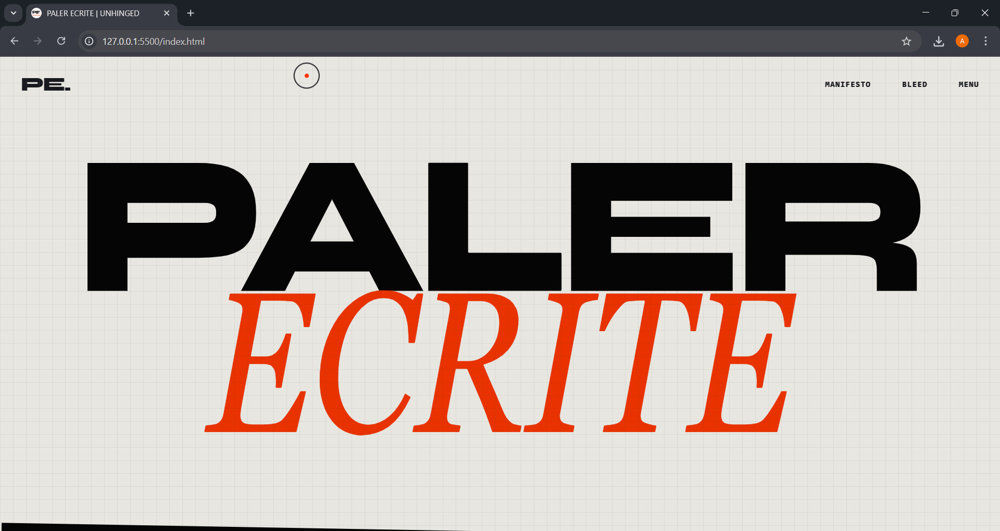
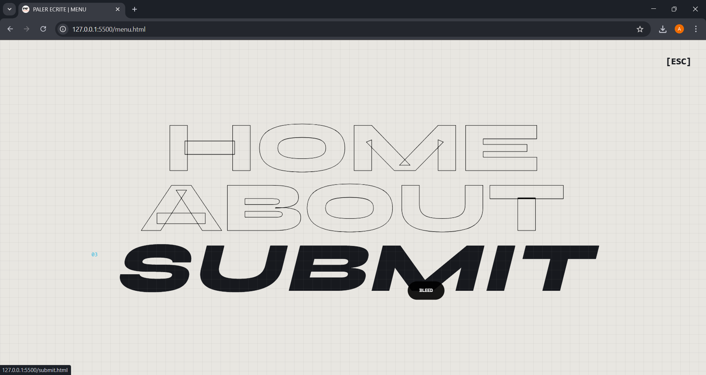
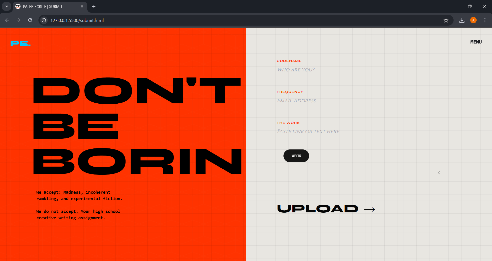
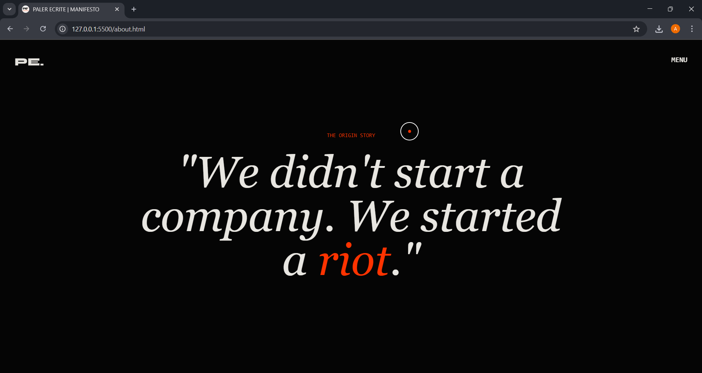

PALER ECRITE // UNLOCKED
"THE ANTIDOTE TO SILENCE."
A radical, brutalist digital publishing platform designed to disrupt the boredom of modern literature. This project features high-performance web animations, custom physics-based interactions, and a raw, noise-soaked aesthetic.
👁️ VISUAL RECONNAISSANCE
<!-- PASTE YOUR IMAGE LINKS INSIDE THE PARENTHESES BELOW -->
<!-- Example:  -->
// 01. THE INTERFACE
(The Landing Page. Noise overlay, chaotic typography, and magnetic interactions.)

// 02. NAVIGATION SYSTEM
(The full-screen menu with dynamic background color shifts.)

// 03. SUBMISSION PROTOCOL
(The brutalist form with interactive input feedback.)

// 04. THE ARCHIVE
(Dark mode manifesto with smooth-scroll parallax.)

⚡ SYSTEM SPECS
1. Tactile Physics Cursor
Replaced the default system cursor with a dual-layer reticle system:
The Dot: A sharp red point (#ff3300) tied instantly to mouse coordinates for precision.
The Ring: A heavy, hollow circle that follows the dot with calculated linear interpolation (Lerp), creating a sense of weight and drag (inspired by Studio Elio but aggressive).
2. Chaotic Typography
Font Stack: 'Syne' (Artistic), 'Space Grotesk' (Technical), 'Cinzel' (Classic/Serif).
Text Scrambling: Custom JavaScript algorithm that decrypts/encrypts text on hover (A -> X -> % -> HELLO).
Marquee: Infinite scrolling text banners using Tailwind animations.
3. Performance Core
Lenis Scroll: Implemented for buttery smooth, momentum-based scrolling that overrides the default browser behavior.
GSAP ScrollTrigger: Elements reveal, float, and parallax based on scroll position.
Page Transitions: A "curtain" effect wipes the screen vertically between page navigations for a seamless Single-Page-Application (SPA) feel.
📂 FILE STRUCTURE
code
Bash
PALER-ECRITE/
├── index.html       # Landing Page (Light Mode)
├── about.html       # Manifesto (Dark Mode)
├── menu.html        # Navigation Hub
├── submit.html      # Submission Form
├── style.css        # UNIFIED Global Styles (Cursor, Noise, Typography)
├── main.js          # UNIFIED Logic (Physics, GSAP, Page Transitions)
└── assets/          # (Optional) Folder for your images
🛠️ INSTALLATION
This is a static site architecture. No heavy frameworks required.
Clone the Repository:
code
Bash
git clone https://github.com/your-username/paler-ecrite.git
Run Locally:
You can open index.html directly, but for the AJAX Page Transitions and Modules to work correctly without CORS errors, use a local server:
VS Code: Right-click index.html -> "Open with Live Server".
Python:
code
Bash
python3 -m http.server
🔧 CREDITS & LIBRARIES
Design Philosophy: Brutalism, Anti-Design.
Smooth Scroll: Lenis
Animation Engine: GSAP (GreenSock)
CSS Framework: Tailwind CSS (CDN)
© 2025 PALER ECRITE. We burn the manuscript to keep the fire alive.